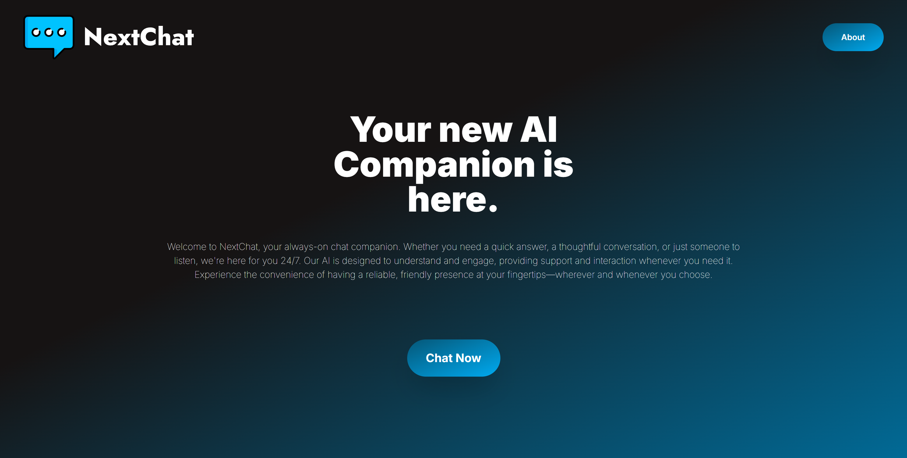
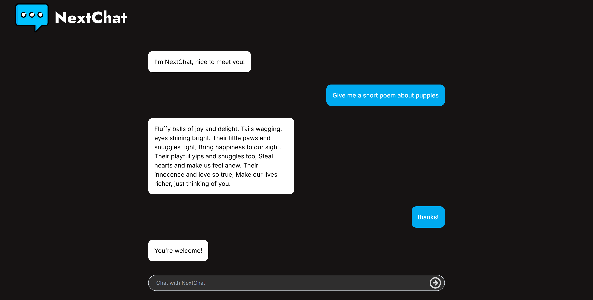
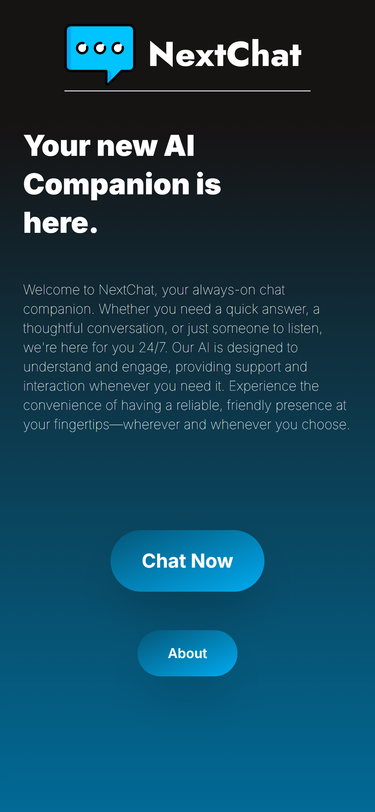
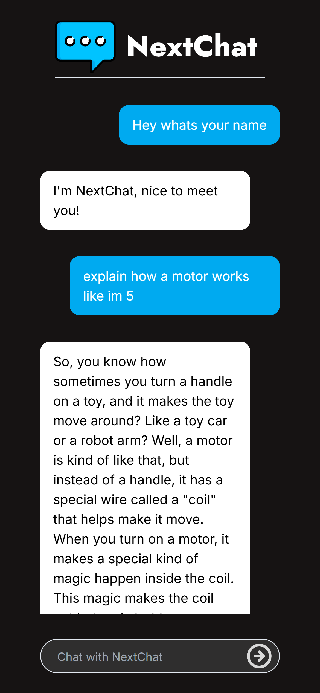

# Welcome to Next Chat
Next Chat is a chat bot wrapped around Llama 3.1 that provides extremely fast AI delivery using the Groq API. This project uses NEXT.js for its frontend. 
The contents of this README include:

 - Screenshots
 - Run the application yourself
# Screenshots

# Running the application yourself
To run Next Chat on your local machine you will need a GroqAPI Key, which if you don't have can get at https://console.groq.com/keys

Then all you have to do is create a a file named .env in the nextchatbot/ directory and create a field for your API key in the following way:

    GROQ_API_KEY="yourkeyhere"
Then simply run `npm run dev` to create a development build of the project. 